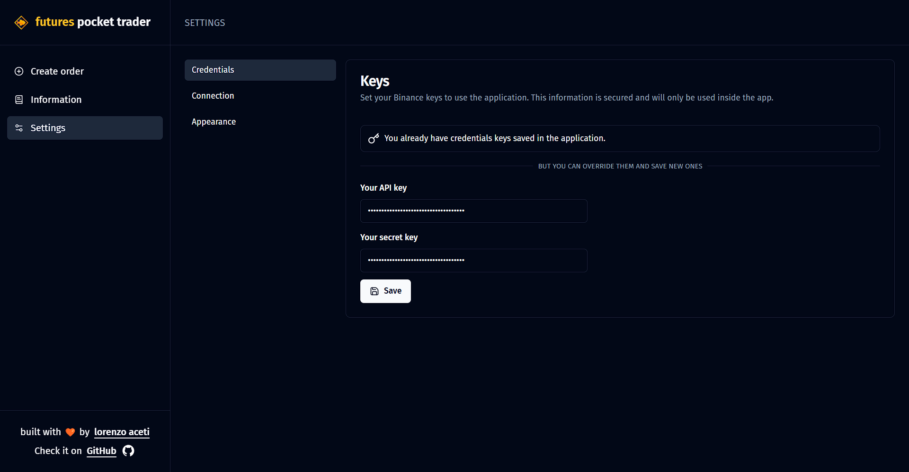

# 🪙 Futures Pocket Trader</h1>

  
  
  
  
  
  

## 📑 About

An application that simplifies creating new orders, checking on information about positions and orders, and the ability to create multiple orders at different prices. All this using Binance Future's API!

Feel free to open new issues and suggest new features. This project is open-source and its main objective is to provide a simplified interface for traders to carry out their operations in the futures market.

<a href="https://www.futurespockettrader.com" target="_blank">Navigate to the app</a>

## 🌟 Features

- Create up to 20 orders at once for a symbol, defining the total size and percentage of price drop that will be divided by the number of orders
- Create single order with few steps
- Set your pockets (list of favorite symbols) and create split orders to all of them at the same time
- Possibility to connect to a testnet account
- Check your list of open positions, being able to filter by symbol and close them in a simple way
- Check your list of open orders, being able to filter by symbol and cancel them simply

## 🤓 How to use

### 1. Set your Binance's API key and Secret key

Firstly, in the "Credentials" page, you must enter your API key and your Binance secret key and hit the save button. 

This application needs the keys to work, as the connection to Binance can only be made with them. Your keys are encrypted, saved locally in the navigator storage and is only decrypted when a request is made, so you can feel safe in using this app.

If you want to test the application without your real money, you can create a <a href="https://testnet.binancefuture.com/en/futures" target="_blank">binance futures testnet account</a>, set its keys and activate the option "Testnet credentials" in the "Connection" page.

### 2. Create a single order

In the "Create order" section, you will find yourself in the "Single" page, to create just one order. Firstly, you must define the symbol, and you can also change its leverage and margin type. Then, you define the price of the currency (you can click the "Last" button to reset to the last market value) and the quantity, which can be in any of the currencies in the pair. Finally, you choose whether to buy/long or sell/short.

In the example below, we will create a BTCUSDT order, with leverage at 10x and with the cross margin type. The order will be created at the price of 67900 USDT, where we will buy 1500 USDT.

### 3. Create a split order

In the "Create order" section, you can go to the "Split" page, to create multiple orders. Same as the previous section, you define the symbol and the price you will buy. However, this time, you will define the total order size, which will be divided by the number of orders you also define. Furthermore, you can define a price drop percentage, that is, the orders created will vary from the defined price to their value with the decreased percentage.

In the example below, we set the initial price to be 50,000 USDT and the total size to be 3,000 USDT. So, we define that 10 orders will be created, with a drop percentage of 30%. In this case, 10 orders will be created, of 300 USDT each (3,000 divided by 10), with the first order created at price 48,500 (3% below the defined 50,000), the second 6% below (47000) and so on until reaching 30% below the price (37,500).

A summary of the orders will then appear on your screen for you to review and confirm. 
**Tip**: if you just want to create multiple orders at the defined price, without variations, just set the drop percentage to 0%.

### 4. Create a pocket split order

In the "Create order" section, you can go to the "Pocket split" page, to create multiple orders to all the symbols within a pocket. You define the pocket for which you want to create orders, the size and quantity of orders for each symbol in the pocket and the drop percentage for each symbol as well. The price is not defined, as it is considered that the initial price of each symbol will be its current market price.

In the example below, we set the pocket to be Main (that contains ETHUSDT, BNBUSDT and ADAUSDT) and the size for each symbol to be 500 USDT. So, we define that 5 orders will be created, with a drop percentage of 10%, for each symbol. In this case, 5 orders will be created for each symbol, of 100 USDT each (500 divided by 5), with the first order created at 3% below the current market price of each symbol, (3% below the defined 50,000), the second 6% below and so on until reaching 10% below the price.

A summary of the orders will then appear on your screen for you to review and confirm, containing the information of the total amount of orders that will be created.

### 5. Open positions information

In the "Information" section, you will find yourself in the "Positions" page. Here, you can check on all your open positions, their most relevant information and the total positioned in USDT. You can also filter by symbol and by side (LONG or SHORT), which will also update the total positioned information (for example, you can view the total you have positioned only in LONG).

Additionally, you can close a position at market price or limit, as well as all positions at once.

### 6. Open orders information

In the "Information" section, you can go to "Orders" page. Here, you can check on all your open orders, their most relevant information and the total USDT. You can also filter by symbol and by side (LONG or SHORT), which will also update the total information (for example, you can view the total, in USDT, of BTCUSDT orders).

Additionally, you can also cancel all orders or cancel a single order.

### 7. Pocket information

In the "Information" section, you can go to "Pockets" page. Here, you can check your pockets, create a new pocket, delete an existing pocket and define the symbols for a pocket.

A pocket is like a list of favorite symbols, which you can use as a preset of a group of symbols in some parts of the application (like pocket split orders page).

## 🎮 Running Locally

### 1. Clone this repository:
<pre>
  <code>
    git clone https://github.com/lorenzoa7/futures-pocket-trader.git
  </code>
</pre>

<h3>2. Install the dependencies:</h3>
<pre>
  <code>
    npm install
  </code>
</pre>

<h3>3. Start the server</h3>
<pre>
  <code>
    npm run dev
  </code>
</pre>

## 🔧 Credits
<a href="https://github.com/lorenzoa7" style='display: flex; flex-direction: column; align-items: center;'>
     
    
        <b>Lorenzo Aceti</b>
    
</a>

## 📌 License
<b>This project is under MIT license.</b>
